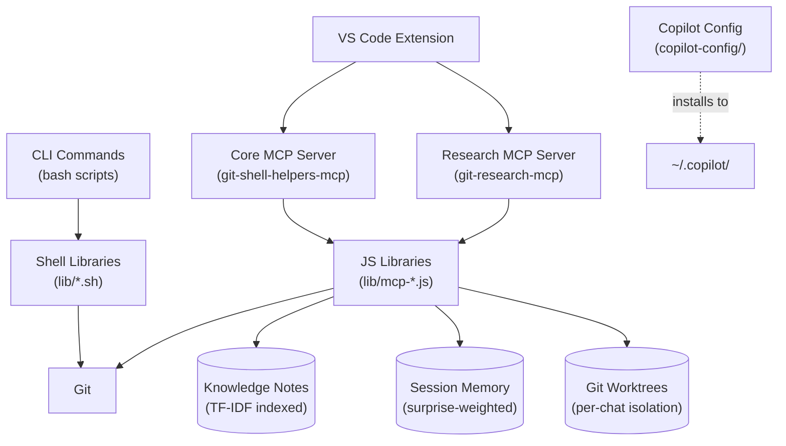
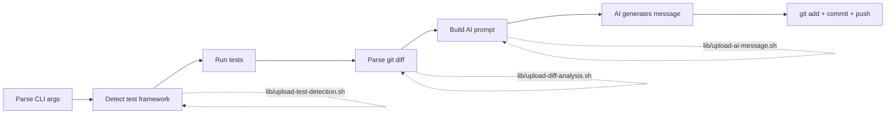
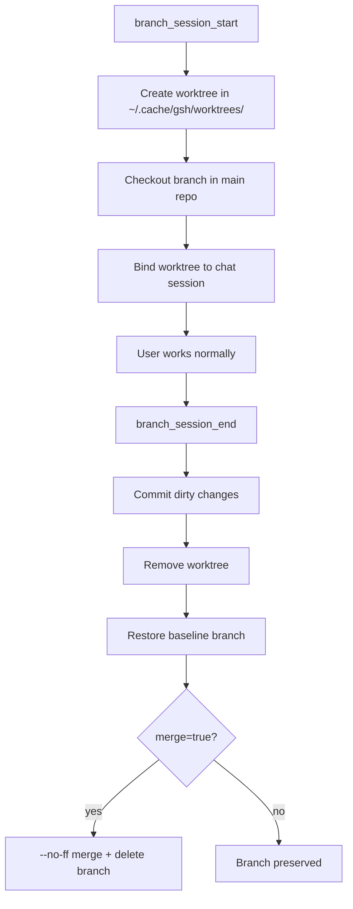
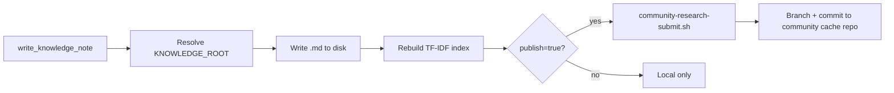

# Architecture — gsh Internals (Contributor Reference)

For contributors and agents working **inside** the github-shell-helpers repository. Covers module inventory, file-level mappings, dataflows, and implementation details.

For user-facing command and tool reference, see `architecture-gsh-user-guide.md`.

---

## System Layers

---

## Shell Libraries (`lib/*.sh`)

Organized by feature area. Sourced by CLI commands at runtime.

### Upload subsystem (`lib/upload-*.sh`)

Decomposes `git-upload` into testable, replaceable units:

- **upload-test-detection.sh** — Detect test frameworks by project type (language-specific heuristics)
- **upload-diff-analysis.sh** — Parse staged/unstaged diffs, compute change summaries
- **upload-ai-message.sh** — Build AI prompt from diff context + test results, request commit message
- **upload-test-output.sh** — Capture and summarize test runner output
- **upload-spinner.sh** — Progress UI (spinners, status lines)
- **upload-risk-scoring.sh** — Risk score computation from diff characteristics

### Environment and shared infrastructure (`lib/env-*.sh`)

- **env-setup.sh** — PATH resolution, dependency checks, environment initialization
- **env-cache.sh** — Caching layer for expensive operations (model detection, etc.)
- **env-ui.sh** — Shared terminal UI helpers (colors, prompts, formatting)

### Other libraries

- **quickstart-detect.sh** — Project type detection for `git-copilot-quickstart`

---

## JS Libraries (`lib/mcp-*.js`)

Each MCP tool is backed by a dedicated module. Both MCP servers (`git-shell-helpers-mcp` and `git-research-mcp`) consume these.

### Git operations

- **mcp-checkpoint.js** — Staging + AI message generation + commit logic
- **mcp-git.js** — Shared git utilities (`execGit`, repo root resolution, branch detection)

### Branch isolation

- **mcp-branch-sessions.js** — Worktree lifecycle: create, end, status, per-chat binding, stash management
- **mcp-workspace-context.js** — Workspace root detection, branch/remote introspection, active session listing

### Code quality

- **mcp-strict-lint.js** — Diagnostic collection from VS Code's language servers with severity filtering

### Knowledge system

- **mcp-knowledge-index.js** — TF-IDF index build/query, local + community merge with source boosting (local 1.15x)
- **mcp-knowledge-rw.js** — Knowledge note read/write/update with path resolution and publish flow

### Session memory

- **mcp-session-memory.js** — Append-only event log with surprise-weighted TF-IDF retrieval

### Research

- **mcp-research.js** — SearXNG search + page scraping engine
- **mcp-web-search.js** — Web search provider abstraction
- **mcp-pdf-extract.js** — PDF text extraction for research
- **mcp-google-headless.js** — Headless Chrome for JavaScript-rendered pages

### Utilities

- **mcp-model-utils.js** — Model ID resolution across providers (GPT, Claude, Gemini)
- **mcp-chat-archive.js** — Chat history archival and search

---

## VS Code Extension (`vscode-extension/`)

### Entry point

`extension.js` — VS Code lifecycle, command registration, MCP server startup. This is a monolithic file; see the modular architecture instructions for decomposition targets.

### Modules (`vscode-extension/src/`)

- **mcp-server.js** — MCP server lifecycle management + tool registration
- **chat-sessions.js** — Per-chat state: branch session bindings, stash management on focus switch
- **worktree-manager.js** — UI integration for branch isolation worktrees
- **format-control.js** — Gate `formatOnSave` during agent edits to prevent formatter interference
- **activity-tracker.js** — User activity tracking for session pulse
- **install-health.js** — Verify gsh installation and PATH availability

---

## MCP Server Entry Points

| Server | Entry | Node.js script |
|--------|-------|-----------------|
| Core | `git-shell-helpers-mcp` (bash wrapper) | `git-shell-helpers-mcp.js` |
| Research | `git-research-mcp` (bash wrapper) | `git-research-mcp.js` |

Both servers use stdio transport and are started by the VS Code extension. The bash wrappers handle PATH setup and delegate to the `.js` files.

---

## Key Internal Dataflows

### git-upload pipeline

### checkpoint (MCP tool)

### Branch session lifecycle

### Knowledge write + publish

---

## Copilot Config Source (`copilot-config/`)

Source of truth for all shipped Copilot customization. Installs to `~/.copilot/`.

| Directory | Contents |
|-----------|----------|
| `instructions/` | Behavioral rules: branch lifecycle, tool safety, software design, session learning, request preparsing |
| `skills/` | Multi-step workflows: DevOps audit pipeline (context → research → evaluate → implement → community submit), Copilot research |
| `agents/` | Agent definitions for specialized tasks |
| `prompts/` | Reusable slash commands |

**Boundary rule**: `copilot-config/` is product source shipped to users. `.github/` is repository development config. Never confuse the two.

---

## Knowledge Path Resolution

The MCP server resolves `KNOWLEDGE_ROOT` per workspace:

1. If `<workspace>/knowledge/` exists and contains `.md` files → use it
2. Otherwise → `<workspace>/.github/knowledge/`

`REPO_KNOWLEDGE_ROOT` always points to `<gsh-install>/knowledge/` (the shipped community KB).

At search time, both local and repo knowledge are merged — local results get a 1.15x score boost. Writes always go to `KNOWLEDGE_ROOT`.

**When working inside the gsh repo itself**: `KNOWLEDGE_ROOT` = `~/bin/knowledge/` = the community KB. Local and shipped overlap — writes to knowledge notes are writes to the community KB.

---

## Build and Test

| Task | Command |
|------|---------|
| Test suite | `bash ./scripts/test.sh` |
| State recovery tests | `bash ./scripts/test-git-upload-states.sh` |
| Build installer | `./scripts/build-dist.sh` |
| Build macOS pkg | `./scripts/build-pkg.sh` |
| Build VSIX | `./scripts/build-vsix.sh` |

Version is stored in `VERSION` (single-line semver).

---

## Default Install Paths

| Data | Default Path | Persistence |
|------|-------------|-------------|
| CLI commands | Added to `PATH` (typically `~/bin/`) | Permanent |
| Copilot config | `~/.copilot/` (instructions, skills, agents, prompts) | User-level, persists across workspaces |
| Knowledge notes (shipped) | `<gsh-root>/knowledge/` | Permanent, TF-IDF indexed |
| Knowledge notes (local) | `<workspace>/.github/knowledge/` | Per-project, TF-IDF indexed |
| Community cache | `<gsh-root>/community-cache/` | Shared via GitHub PRs |
| Session memory | `<workspace>/.github/session-memory/session-log.jsonl` | Per-workspace, append-only |
| Branch worktrees | `~/.cache/gsh/worktrees/<branch>` | Temporary, per-chat |
| Community settings | `~/.copilot/devops-audit-community-settings.json` | User-level |
