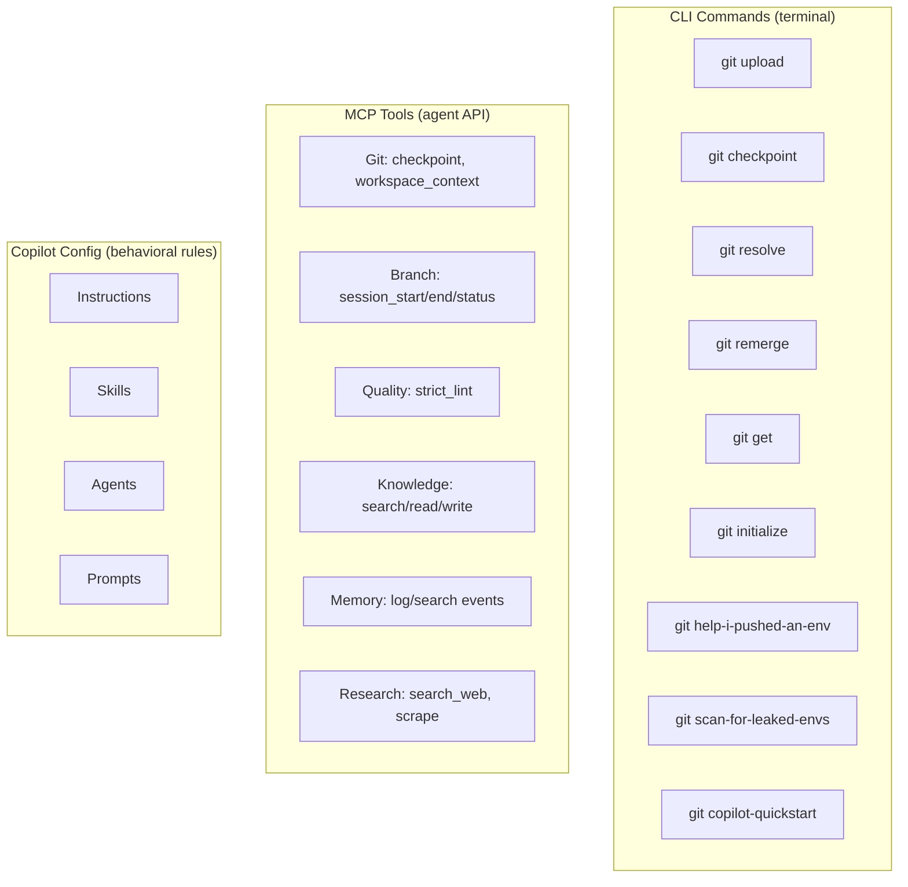
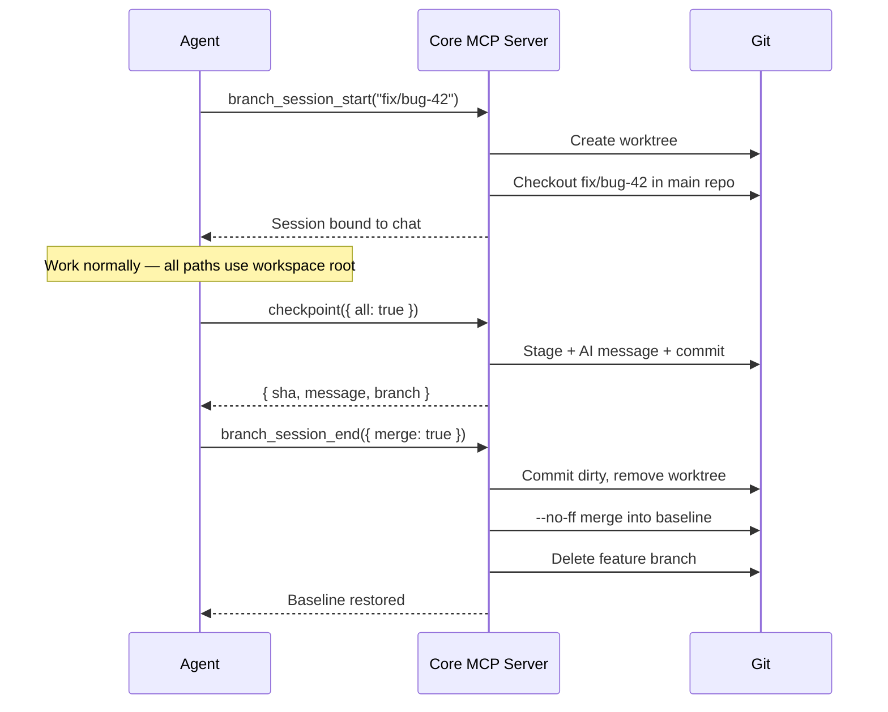
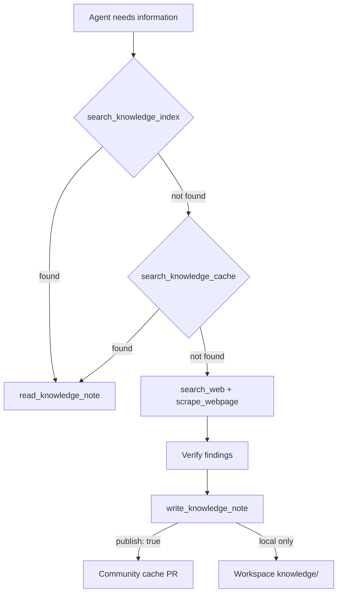

# Architecture — gsh User Guide

For agents working **with** gsh (any project that has github-shell-helpers installed). Covers CLI commands, MCP tools, dataflows, and configuration.

For internal module details (file-level mappings, JS/shell library inventory), see `architecture-gsh-internals.md`.

---

## What gsh Provides

---

## CLI Commands

All commands are git subcommands — run them as `git <name>` (e.g., `git upload`).

| Command | What it does |
|---------|-------------|
| `git upload` | Stage → auto-detect tests → run tests → AI-generate commit message → push |
| `git checkpoint` | Stage → AI-generate commit message → commit locally (no push) |
| `git initialize` | Clone + initialize a repo |
| `git resolve` | Safe conflict resolution with backup branches |
| `git remerge` | Merge a branch back into its target, handle conflicts |
| `git get` | Fetch a branch from remote |
| `git fucked-the-push` | Soft-reset last commit + force-push-with-lease |
| `git help-i-pushed-an-env` | Scrub secrets from entire git history (BFG-based) |
| `git scan-for-leaked-envs` | Scan repo for leaked secrets/env files |
| `git copilot-quickstart` | Bootstrap Copilot customization for a project |
| `git copilot-devops-audit` | Run a Copilot customization audit |

---

## MCP Tools

Two MCP servers expose tools to agents. Both use stdio transport and are managed by the VS Code extension.

### Core Server (`git-shell-helpers-mcp`)

Git operations, workspace awareness, branch isolation, and code quality.

| Tool | Purpose |
|------|---------|
| `checkpoint` | Stage changes, AI-generate commit message from diff, commit locally. Pass `all: true` to stage everything. Optionally pass `context` for extra hint. |
| `workspace_context` | Report workspace roots, current branch, dirty state, remotes, active branch sessions |
| `strict_lint` | Run compiler/linter diagnostics with severity filtering (`severityFilter: "all"` by default) |
| `branch_session_start` | Create an isolated git worktree bound to the current chat session |
| `branch_session_end` | Commit outstanding changes, remove worktree. Pass `merge: true` to merge into baseline. |
| `branch_status` | List all active worktrees, their branches, dirty/clean state, recent commits |
| `branch_read_file` | Read a file from any branch without checkout |
| `branch_cleanup` | Remove stale worktrees |

### Research Server (`git-research-mcp`)

Knowledge management, web research, session learning, and chat history.

| Tool | Purpose |
|------|---------|
| `search_knowledge_index` | TF-IDF search across local + community knowledge (automatically merged, local boosted 1.15x) |
| `read_knowledge_note` | Read a knowledge note by filename |
| `write_knowledge_note` | Create a knowledge note. Pass `publish: true` for community submission. |
| `update_knowledge_note` | Update a specific section of a note (targets by heading) |
| `append_to_knowledge_note` | Append content to an existing note |
| `search_knowledge_cache` | Keyword fallback when TF-IDF misses exact terms |
| `build_knowledge_index` | Rebuild the TF-IDF index manually |
| `search_web` | SearXNG-powered web search |
| `scrape_webpage` | Extract content from a URL |
| `log_session_event` | Log an action + outcome + surprise score to session memory |
| `search_session_log` | Search session memory (surprise-weighted retrieval) |
| `get_session_summary` | Aggregate stats and recent events from session memory |
| `search_chat_history` | Search archived conversations |
| `compact_chat_archive` | Compress chat history |
| `analyze_images` | Vision analysis of images |
| `take_screenshot` | Capture a screenshot |
| `list_language_models` | List available AI models in current session |
| `get_project_direction` | Get project roadmap/direction context |

---

## Branch Session Workflow

Branch sessions give each chat its own isolated branch via git worktrees. The workspace looks like a normal branch — the extension manages focus switching transparently.

**Key points:**
- `workspace_context()` shows active branch sessions
- `branch_status()` shows all worktrees across chats
- Switching chats auto-switches the visible branch
- Enable via: Settings → Git Shell Helpers → Branch Sessions → Enabled

---

## Knowledge System

### How knowledge flows

### Path resolution

| Context | KNOWLEDGE_ROOT resolves to |
|---------|---------------------------|
| Workspace has `knowledge/*.md` | `<workspace>/knowledge/` |
| Otherwise | `<workspace>/.github/knowledge/` |

`update_knowledge_note` targets sections by heading — notes should use clear `##` headings for incremental updates.

---

## Copilot Config

gsh ships behavioral rules, skills, agents, and prompts that install to `~/.copilot/`. These customize how AI agents behave in any workspace.

### Instructions (behavioral rules)

Key instruction files and what they govern:

| Instruction | Governs |
|-------------|---------|
| `branch-lifecycle` | Feature branch workflow: when to branch, how to merge, cleanup |
| `branch-workspace-control` | Worktree-based branch isolation per chat |
| `request-preparse` | Internal request rewriting with objective/scope/constraints before execution |
| `expand-and-engage` | Knowledge-first protocol, tool-use discipline, strict lint after edits |
| `session-learning` | Surprise-weighted session memory (log → search → learn) |
| `vscode-tool-safety` | File edit safety, terminal rules, compiler-as-ground-truth |
| `software-design` | Universal design principles (validate at boundaries, SRP, DRY) |
| `tiered-agents` | Cost-proportional model routing (quick/capable/thorough) |
| `subagent-strategy` | Default-to-cheap subagent dispatch |
| `git-checkpoint` | When and how to commit (milestone-based, not timer-based) |
| `self-maintaining-context` | Auto-update copilot-instructions.md and knowledge notes on structural changes |

### Skills (multi-step workflows)

- **DevOps Audit** — 5-phase pipeline: context → research → evaluate → implement → community submit
- **Copilot Research** — Research method for current Copilot customization guidance

### Install location

All config installs to `~/.copilot/` (instructions, skills, agents, prompts). The VS Code extension and MCP servers are added to PATH.

---

## Session Memory

Agents log actions and outcomes to per-workspace session memory. High-surprise events surface preferentially in future searches.

| Operation | Tool | Purpose |
|-----------|------|---------|
| Log | `log_session_event` | Record action + outcome + surprise (0.0–1.0) + tags |
| Search | `search_session_log` | Find past approaches, failures, and lessons |
| Summary | `get_session_summary` | Aggregate stats, outcome breakdown, recent entries |

Session logs live at `<workspace>/.github/session-memory/session-log.jsonl`. Append-only — never compacted.

---

## Configuration Reference

### Git config keys (per-repo)

| Key | Default | Purpose |
|-----|---------|---------|
| `checkpoint.enabled` | `true` | Gate for git-checkpoint command |
| `checkpoint.push` | `false` | Always push after checkpoint commit |
| `checkpoint.sign` | `false` | GPG-sign checkpoint commits |

### VS Code settings

| Setting | Default | Purpose |
|---------|---------|---------|
| `gitShellHelpers.branchSessions.enabled` | `false` | Enable worktree-based branch isolation |
| `gitShellHelpers.sessionMemory.enabled` | `false` | Enable surprise-weighted session memory |
| `gitShellHelpers.formatControl.bypassOnAgentSave` | `false` | Suppress formatters during agent file saves |
| `gitShellHelpers.checkpoint.autoPush` | `false` | Auto-push after checkpoint commits |

### Community settings (`~/.copilot/devops-audit-community-settings.json`)

| Field | Purpose |
|-------|---------|
| `communityRepo` | GitHub repo for community cache (default: `RockyWearsAHat/github-shell-helpers`) |
| `shareKnowledge` | Enable auto-submit of published knowledge notes |
| `localClone` | Path to local gsh clone |
